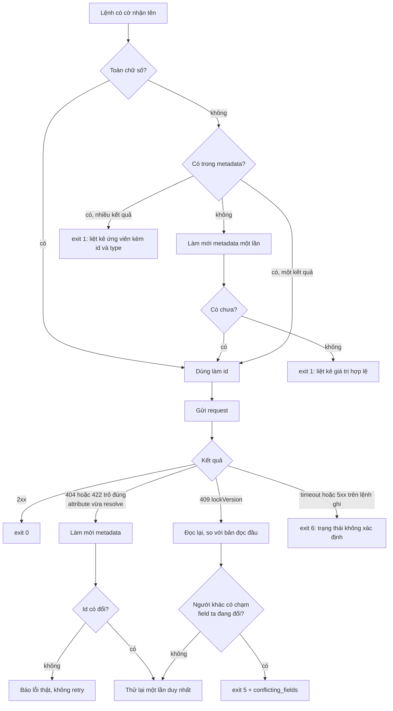

# Kế hoạch: `op-cli`, CLI npm cho OpenProject kèm skill

Bản v2, chốt ngày 2026-08-22 sau năm vòng grill. Bản gốc giữ ở [PLAN.v0.md](PLAN.v0.md) để đối chiếu.

Từ vựng dùng trong tài liệu này định nghĩa ở [CONTEXT.md](CONTEXT.md). Hai quyết định đắt nhất ghi riêng ở [docs/adr/0001-no-escape-hatch.md](docs/adr/0001-no-escape-hatch.md) và [docs/adr/0002-lazy-metadata-per-profile.md](docs/adr/0002-lazy-metadata-per-profile.md).

## Toạ độ dự án

- Repo: `/Users/tuanhv/Desktop/PERSONAL/openproject-cli`, remote `git@github.com:hoangvantuan/openproject-cli.git`, branch `main`, chưa có commit
- Package npm: `op-cli` (đã kiểm, còn trống). Một binary duy nhất: `op-cli`
- Bản Python cũ: `origin/feature/openproject-skill` của `shun_claude_plugin`, 43 file `.py` trong 9 package con. Giữ như mốc lịch sử, không merge, không xoá

## 0. Quyết định đã chốt

| # | Hạng mục | Chốt | Lý do gốc |
|---|---|---|---|
| 1 | Người dùng bậc một | Agent và tác giả. Publish npm public nhưng không cam kết cộng đồng ở 0.x | Trả tiền trước cho người dùng chưa tồn tại là lỗ ròng |
| 2 | Ngôn ngữ | TypeScript / Node 20+ | API OpenProject là REST/HAL thuần, port là dịch cơ học |
| 3 | Nền tảng HTTP | Tự viết lớp mỏng trên `fetch`. Không dùng `op-client` | `op-client` thiếu 6/9 domain, bản cuối 2022, OAuth2 only, enum hardcode, không có schema |
| 4 | Escape hatch | Không có, bằng mọi hình thức | ADR-0001 |
| 5 | Phạm vi 0.1.0 | 6 nhóm lệnh (`auth`, `meta`, `project`, `wp`, `time`, `doctor`). 9 domain còn lại hoãn tới khi va phải | Toàn bộ giá trị và toàn bộ độ khó nằm ở resolve, tức ở `wp`, `time`, `project` |
| 6 | Metadata | Cache thật, lazy, khoá theo profile | ADR-0002 |
| 7 | Retry | Chỉ khi chứng minh được là vô hại, tối đa một lần | ADR-0002 |
| 8 | Hình dạng lệnh | Danh từ trước, động từ sau, hai tầng: `op-cli wp list` | Chuẩn `gh`/`az`; skill dạy `--help` thay vì liệt kê lệnh |
| 9 | Output | Mặc định bảng, `--json` tường minh, `OP_CLI_OUTPUT=json` cho agent | Hành vi không phụ thuộc TTY, để một lệnh cho một kết quả ở mọi nơi |
| 10 | Lỗi | Theo chế độ output, nhưng chế độ text luôn nhét `[CODE]`. `code` là tập đóng có test | Không ai phải parse câu tiếng Anh |
| 11 | Xoá | Đảo ngược có chủ ý (#18): `project delete` mở bằng cờ `--yes` như `wp delete` và `time delete`; `user delete` vẫn từ chối hoàn toàn ở 0.x | Quyết định gốc và ghi chú đảo ngược giữ ở ADR-0001 phần Consequences |
| 12 | Ngữ cảnh | Nhiều profile = (instance + token + project mặc định), cộng một profile ẩn khi chỉ có biến môi trường | Sửa sau rất đắt vì nằm trong đường dẫn cache và mọi lệnh |
| 13 | Secret | Ưu tiên biến môi trường; mặc định `credentials.json` chmod 600; keychain để sau | CI và agent cần env; keychain khó cross-platform |
| 14 | Config | `config.json` cạnh `credentials.json`, cùng định dạng. Bỏ TOML | File do `auth login` ghi, không phải người gõ. Bớt một dependency |
| 15 | Dependency runtime | Đúng một: `commander` | Bảng tự vẽ, màu bằng ANSI thủ công, `fetch` và `JSON` có sẵn |
| 16 | Skill | Nằm trong repo tại `skills/op-cli/`, người dùng tự cài. Không có `op-cli skill install` | Copy là snapshot, và snapshot lệch khỏi binary là đúng bệnh cần chặn |
| 17 | Test | Unit trên fixture HAL thật. Không docker compose. Smoke chạy tay trên instance thật trước publish | Hợp đồng HAL đổi theo phiên bản instance, không theo commit |
| 18 | Giấy phép | MIT + NOTICE tuyên bố không liên kết OpenProject GmbH | Gọi REST không lây GPLv3; tên gợi sản phẩm chính thức nên phải nói rõ |
| 19 | Ngôn ngữ tài liệu | README, CONTEXT, ADR, SKILL bằng tiếng Anh. Không có `README.vi.md` | Một bản để không phải đồng bộ hai bản |

Đã bỏ khỏi đường tới 0.1.0 so với bản gốc: nhóm lệnh `api`, `op-cli skill install`, `auth curl` và mọi thứ in token, `--filter` thô, tầng lệnh proxy của 9 domain, docker compose integration, matrix Node 20/22/24 × ubuntu/macos, changesets, OIDC provenance, `README.vi.md`, alias binary `opj`, completion shell, bot đồng bộ skill sang repo plugin.

## 1. Kiến trúc repo

```
openproject-cli/
  package.json            # bin: { "op-cli" }, name: "op-cli", type: module, engines: node >=20
  CONTEXT.md
  docs/adr/
  src/
    bin.ts                # entry, parse argv, dispatch, map lỗi -> exit code
    core/
      http.ts             # fetch + Basic auth + timeout; retry 429/5xx CHỈ cho phương thức đọc
      paginate.ts         # async generator theo _links.nextByOffset
      hal.ts              # bóc _embedded.elements, _links -> { id, name }
      filters.ts          # dựng JSON filters/sortBy của OpenProject
      errors.ts           # OpCliError { code, status, hint }, tập code đóng
      duration.ts         # ISO 8601 duration <-> giờ thập phân, và "1h30m"
      define.ts           # helper khai báo lệnh: một domain proxy = dưới 30 dòng
    context/
      profile.ts          # đọc/ghi config.json + credentials.json, giải ngữ cảnh
      metadata.ts         # nạp lazy, làm mới, đọc/ghi đĩa
      resolve.ts          # tên -> id, và luồng retry có chứng minh
    commands/
      auth.ts meta.ts project.ts wp.ts time.ts doctor.ts
    output/
      table.ts json.ts fields.ts
  skills/op-cli/
    SKILL.md              # nguồn sự thật duy nhất của skill
  scripts/smoke.sh        # vòng đời thật trên instance nháp, chạy tay trước publish
  test/
    unit/**  fixtures/**
  .github/workflows/ci.yml
```

`define.ts` là mắt khoá của quyết định #5: vì không có escape hatch, việc thêm một domain phải rẻ đến mức không đáng trì hoãn. Nó nhận một bảng khai báo (đường dẫn endpoint, cờ, tên cột, khoá xuất JSON) và sinh ra lệnh, giúp thêm `notify list` hay `admin roles` tốn dưới 30 dòng và không cần bàn thiết kế lại.

## 2. Profile và metadata

`~/.config/op-cli/config.json`, người không phải tác giả chính, `auth login` ghi:

```json
{
  "default_profile": "work",
  "profiles": {
    "work":     { "url": "https://op.company.com", "project": 13, "output": "table" },
    "selfhost": { "url": "http://172.16.0.48:8080" }
  }
}
```

`~/.config/op-cli/credentials.json`, chmod 600: `{ "work": { "api_key": "..." } }`

Thứ tự ưu tiên khi giải ngữ cảnh: cờ dòng lệnh, rồi biến môi trường (`OPENPROJECT_URL`, `OPENPROJECT_API_KEY`, `OP_CLI_PROFILE`, `OP_CLI_PROJECT`, `OP_CLI_OUTPUT`, `OP_CLI_CACHE_DIR`), rồi profile đang chọn, rồi profile mặc định. Có env đầy đủ thì CLI chạy được mà không cần file nào.

Đường dẫn metadata:

| Trường hợp | Đường dẫn |
|---|---|
| Có profile tên | `~/.cache/op-cli/<profile>/` |
| Chỉ có biến môi trường | `~/.cache/op-cli/env-<sha1(url)>/` |
| Có `OP_CLI_CACHE_DIR` | Thay gốc `~/.cache/op-cli` |

Khoá theo profile chứ không theo `sha1(url)` vì nội dung phụ thuộc quyền của token: hai profile cùng URL, một token thường một token admin, sẽ đầu độc `members`, `custom_fields` và cờ admin của nhau. Vì cùng lý do, danh tính người đang xác thực không nằm trong metadata dùng chung.

Không có bước `meta init`. Lệnh đầu tiên trên máy sạch tự nạp phần metadata nó cần, chậm thêm chừng một giây, rồi ghi đĩa. `meta refresh` là công cụ khắc phục sự cố, không phải bước thiết lập.

## 3. Nội dung metadata

Giữ: `project{id,identifier,name}`, `types[]{id,name,is_milestone}`, `statuses[]{id,name,is_closed,is_default}`, `priorities[]{id,name,is_default}`, `versions[]{id,name,status}`, `categories[]{id,name}`, `members[]{membership_id,user_id,name,type,roles[]{id,title}}`, `custom_fields{}`, `activities[]{id,name,is_default}`, `instance{url,api_version,core_version,fetched_at}`.

Bỏ so với bản gốc, 12 field: `generated_at` (trùng vai `fetched_at`), `instance.user_login` và `instance.user_email` và cả khối `instance.user` (dữ liệu cá nhân, và phụ thuộc token nên không được nằm trong file dùng chung), `project.description`, `project.active`, `project.public`, `members[].principal_href` (suy ra từ `user_id`), `members[].roles[].href`, `types[].color` và `statuses[].color` và `priorities[].color` (bảng không tô màu theo instance), `statuses[].position` và `priorities[].position` (sắp xếp lúc fetch rồi bỏ), `versions[].start_date` và `.end_date` và `.description`.

Thêm, bốn mục đều có công dụng cụ thể: `members[].type` (User, Group, Placeholder: memberships trộn cả group nên assignee phải phân biệt), `custom_fields[type][key].allowed_values` chỉ khi tối đa 50 phần tử (resolve và validate dropdown), `activities[]` theo project (`op-cli time log --activity "Development"`, khắc phục việc `list_activities()` bản Python trả rỗng), `instance.api_version` và `instance.core_version` (để `doctor` cảnh báo instance quá cũ).

`is_milestone`, `is_default`, `versions[].status` dùng để validate đầu vào, không chỉ để hiển thị.

## 4. Resolution và luồng retry

Mọi cờ nhận cả tên lẫn id. Giá trị toàn chữ số coi là id, ngược lại tra metadata. Miss thì làm mới một lần rồi thử lại, vẫn miss thì exit 1 kèm danh sách giá trị hợp lệ gần đúng nhất.



Điều kiện "id có đổi" là chốt rẻ nhất và quan trọng nhất: nếu làm mới không đổi gì thì retry chắc chắn thất bại y như lần đầu, nên bỏ luôn, tiết kiệm một round trip và giữ thông điệp lỗi trung thực.

Chín cạm bẫy của SKILL.md cũ, sau khi có CLI:

| Cạm bẫy cũ | Sau khi có CLI |
|---|---|
| type/status/priority id hardcode | Lớp resolve, biến mất khỏi tài liệu |
| custom field theo project và type | `--field "Tên=Giá trị"`, CLI tự tra schema đúng type |
| `get_schema()` cần cả project_id và type_id | Nội bộ CLI, biến mất |
| member theo tên | `--assignee "Hung"`, trùng tên thì exit 1 kèm id của từng ứng viên |
| `hours` là ISO 8601 duration | CLI luôn xuất `hours` thập phân, giữ `hours_iso` trong `--json` |
| generator không có `len()` | `op-cli wp count` |
| `list_time_entries` filter sai tên | `op-cli time list --wp 675`, CLI tự dựng `entity_type` và `entity_id` |
| `get_work_packages_time` trả dict | `op-cli time list --wp 675,598,577` trả mảng phẳng có cột `wp` |
| identifier khác name | `op-cli project get` nhận id, identifier hoặc tên, tự phân biệt |
| giới hạn phân trang cắt im lặng | Cảnh báo truncation lên stderr, xem mục 6 |

### Cú pháp giá trị

`--field "Tên=Giá trị"` với các luật tường minh, mỗi luật có một thông điệp lỗi dạy được:

| Ca | Luật |
|---|---|
| Giá trị chứa `=` | Tách ở dấu `=` đầu tiên |
| Field nhiều giá trị | Lặp cờ `--field` cho cùng một tên |
| Xoá giá trị đang có | `--field "Tên="`. Quy ước phải thuộc, nên phải nằm trong `--help` của lệnh |
| Field bool | Chỉ nhận `true` hoặc `false` |
| Field kiểu user | Giá trị chạy qua đúng lớp resolve như `--assignee` |
| Trùng tên field giữa hai type | exit 1, in hai ứng viên kèm type, yêu cầu dùng thẳng `--field "customField8=..."` |

`--hours` nhận `1.5` hoặc `1h30m`, luôn xuất ra thập phân.

### Bề mặt lọc

Chỉ cờ riêng, không có `--filter` thô: `--status`, `--type`, `--assignee`, `--author`, `--version`, `--category`, `--priority`, `--parent`, `--updated-after`, cộng hai cờ tiện `--open` và `--closed` ánh xạ sang toán tử `o` và `c` của OpenProject. Lặp một cờ nghĩa là OR, khớp đúng ngữ nghĩa `values[]` của API. Bắt buộc hỗ trợ `--assignee me` và `--updated-after today|yesterday|7d`, vì đó là hai chỗ agent hay tự dựng sai định dạng nhất.

## 5. Bề mặt lệnh 0.1.0

```
auth      login | logout | list | use <profile> | status
meta      refresh | show | clear
          types | statuses | priorities | members | versions | categories | fields | activities
project   list | get | create | update | copy | star | unstar | versions | categories | types
wp        list | count | get | create | update | delete | comment | comments | history
          relations | relate | unrelate | schema
time      list | get | log | update | delete | report
doctor
```

Khoảng 48 lệnh con. Từ "cache" không xuất hiện trên bề mặt lệnh: sau ADR-0002 nó là chi tiết cài đặt, không phải khái niệm người dùng.

Quy ước xuyên suốt: `--project`, `--profile`, `--json`, `--fields`, `--limit`, `--all`, `--yes`, `--quiet`.

Hoãn tới khi va phải, mỗi cái là một issue rời: `user`, `group`, `member`, `attach`, `doc`, `wiki`, `query`, `notify`, `admin`, cùng `completion`. Vì không có escape hatch, "chưa cần" và "chưa làm được" là một câu, nên nhu cầu thật sẽ tự lộ ra. Tiêu chí: domain chỉ cần auth, làm sạch HAL và exit code thì khai báo qua `define.ts` và làm ngay; domain cần resolve thì phải có fixture và test ba nhánh trước khi vào.

Ánh xạ từ bản Python, để không mất năng lực nào ngoài phần hoãn có ý thức:

| Hàm Python | Thay bằng |
|---|---|
| `list_open_statuses`, `list_closed_statuses` | `meta statuses --open` / `--closed` |
| `get_work_package_time`, `get_work_packages_time` | `time list --wp 675,598` |
| `get_user_time_today` | `time list --user me --from today` |
| `list_project_types` | `project types` |
| `get_activity` | `meta activities` |
| `check_connection` | `doctor` |
| `toggle_favorite` | `project star` / `project unstar` |
| `load_session_config`, `require_config`, `is_config_initialized`, `print_config_summary`, 8 hàm `get_*_id` | Nội bộ CLI, không phải lệnh |
| `list_unread`, `list_by_reason`, `get_query_default`, `list_wiki_attachments` | Thuộc domain đã hoãn |

## 6. Hợp đồng output và lỗi

Mặc định bảng, tự tắt màu và bo góc khi không phải TTY. Nội dung không bao giờ phụ thuộc TTY: một lệnh cho một kết quả ở mọi nơi, để báo lỗi và test không bị nhoè.

| Chế độ | Hình dạng |
|---|---|
| Mặc định | Bảng |
| `--json` | Mảng JSON đã làm sạch HAL, `_links` gọn thành `{id, name}` |
| `--all --json` | NDJSON, một bản ghi mỗi dòng |

Ba hình dạng, không thêm biến thể thứ tư: không bọc phong bì `_meta` quanh mảng. `--fields` tác dụng lên cả bảng và JSON với cùng một danh sách tên.

Phân trang: mặc định `--limit 100`. Nếu tổng lớn hơn số trả về thì in lên stderr `showing 100 of 340; use --all`, exit code vẫn 0. Cần con số tổng đáng tin thì dùng `op-cli wp count` với cùng bộ cờ lọc, dùng mẹo `pageSize=1` như bản Python.

Mã thoát:

| Code | Nghĩa |
|---|---|
| 0 | Thành công |
| 1 | Dùng sai: thiếu tham số, resolve thất bại, xác nhận bị từ chối |
| 2 | Lỗi API 4xx/5xx ngoài các nhóm dưới |
| 3 | Xác thực hoặc thiếu quyền (401, 403) |
| 4 | Không tìm thấy (404) |
| 5 | Xung đột (409, lockVersion) |
| 6 | Lỗi mạng, quá thời gian, hoặc trạng thái không xác định sau lệnh ghi |
| 7 | Phiên bản instance không hỗ trợ (mở rộng hợp đồng từ issue #6, trước khi có consumer; 4 đã dành cho not found) |

Lỗi in ra stderr, theo chế độ output, nhưng chế độ text vẫn nhét code máy đọc được:

```
error: type "Bug UAT" not found [TYPE_NOT_FOUND]
hint: op-cli meta refresh
```

```json
{"error":{"code":"CONFLICT","status":409,"message":"...","hint":"...","conflicting_fields":["status"]}}
```

`code` là tập đóng khai báo ở `errors.ts`, có test buộc mọi lỗi phải mang một code trong tập đó. Đây là thứ khó đổi nhất trong toàn bộ CLI: hễ skill hoặc script bắt nó là đã hứa giữ nó.

## 7. An toàn khi ghi

| Thao tác | Hàng rào |
|---|---|
| `wp delete`, `time delete` | `--yes` |
| `project delete` | `--yes`, như hai lệnh xoá còn lại (#18, đảo quyết định cũ) |
| `user delete` | CLI từ chối hoàn toàn ở 0.x, không cờ nào mở được. Muốn xoá thì vào web UI |
| Ghi hàng loạt | `op-cli wp create --stdin < wps.json` nhận mảng JSON, in NDJSON từng dòng kèm trạng thái, không dừng ở lỗi đầu (`--fail-fast` để đổi). `--dry-run` chỉ có ở đường này |
| 5xx hoặc timeout trên lệnh ghi | Không bao giờ retry. exit 6, nói rõ trạng thái không xác định |

Hàng rào nhắm vào tác nhân thật: `--yes` khi không TTY và "gõ lại identifier" đều chỉ chặn được người, trong khi tác nhân có khả năng xoá sai nhiều nhất là agent. Quyết định gốc của mục này dự kiến mở `project delete` bằng biến môi trường tường minh (`OP_CLI_ALLOW_DESTRUCTIVE=1`), không bằng một cờ; issue #18 đảo thành cờ `--yes` nhất quán với `wp delete` và `time delete`, và phương án biến môi trường bị bỏ.

## 8. Skill

`skills/op-cli/SKILL.md`, cấu trúc skill chuẩn, frontmatter `name: op-cli` và `description` viết theo lối kích hoạt (nêu OpenProject, work package, time entry, tên lệnh `op-cli`). Người dùng tự cài, không có lệnh `skill install`, không có `references/` ở 0.1.0 vì `--help` đã là tài liệu tham chiếu.

Bốn mục, khoảng 90 dòng, thứ tự có ý:

1. **Ranh giới.** CLI thiếu lệnh thì báo người dùng và dừng. Không `curl`, không đọc `credentials.json`. Ba lệnh xoá đều cần `--yes` tường minh, còn `user delete` bị từ chối là cố ý, đừng tìm cách lách. Ba quy ước phải thuộc: `--field "Tên="` là xoá, `--all --json` là NDJSON, cảnh báo truncation nằm ở stderr.
2. **Khởi động.** `export OP_CLI_OUTPUT=json`, rồi `op-cli auth status`.
3. **Bản đồ ý định sang lệnh**, khoảng 25 dòng "muốn X thì chạy Y".
4. **Hợp đồng lỗi.** Bảng `code` kèm hành động khắc phục. Đọc `[CODE]`, không đọc câu tiếng Anh.

Mục 1 đứng đầu vì nó là mục duy nhất `--help` không bao giờ dạy được, và là mục duy nhất mà vi phạm gây hậu quả không hoàn tác. Nó cũng là điều kiện để ADR-0001 có hiệu lực thật: Q4 và Q5 chặn đường thoát trong CLI, chỉ skill chặn được đường thoát quanh CLI.

Test trong CI đọc mọi khối lệnh trong `SKILL.md` và chạy `--help` tương ứng, thất bại nếu skill nhắc tới lệnh hoặc cờ không tồn tại. Đây là cách chặn cứng tài liệu trôi khỏi code, và nó rẻ vì skill nằm cùng repo.

## 9. Test và CI

- Một seam duy nhất: `run(argv, env, io)` gọi in-process, HTTP giả bằng `undici` MockAgent, config và metadata trỏ vào thư mục tạm qua env, assert trên stdout, stderr, exit code và các request đã ghi. Mọi hành vi chỉ có nghĩa ở mức CLI đều test ở đây: resolve và thông điệp lỗi, cả hai luật retry, phân trang và cảnh báo truncation, ba hình dạng output, hợp đồng lỗi, hàng rào xoá. Mỗi lệnh kiểm ba nhánh: thành công, resolve thất bại, lỗi API.
- Đúng hai ngoại lệ test trực tiếp như hàm thuần: `duration.ts` (ISO 8601 hai chiều, và `1h30m`) và `filters.ts` (khớp đúng JSON mà OpenProject chờ đợi). Cả hai là chuyển đổi toàn phần với hàng chục ca biên, đi qua CLI sẽ tốn một mock HTTP và một lần parse argv mỗi ca mà không kiểm thêm được gì.
- Một smoke test cấp tiến trình spawn binary đã build đúng một lần, để chắc entry point, shebang và packaging chạy được, vì seam in-process không thấy được ba thứ đó.
- Không test riêng cho `paginate`, `resolve`, `http`, `errors`, `metadata`: hành vi của chúng quan sát được ở seam CLI, và test theo module sẽ khoá vào cấu trúc nội bộ (đổi chỗ retry giữa `resolve` và `http` là phải viết lại test dù hành vi không đổi).
- Fixture HAL lấy từ instance thật rồi làm sạch. Fixture custom field sinh từ schema, test theo dữ liệu bảng, không hardcode `customField8`.
- Không có integration tự động, không docker compose. Thay bằng `scripts/smoke.sh` chạy tay trên instance thật với một project nháp: tạo, sửa, log time, xoá. Chạy trước mỗi lần publish. Đánh đổi đã biết: hồi quy trên đường ghi thật sẽ bị bắt muộn hơn, chấp nhận được vì chỉ có một người chạy đường đó.
- CI: một job, Node 22, ubuntu. Lint, unit test, test nhất quán skill.
- Publish bằng `npm publish` tay ở 0.x.
- `--version` in cả version CLI và version instance khi có metadata.

## 10. Lộ trình

| Mốc | Nội dung | Xong khi |
|---|---|---|
| M1 Xương sống | `core/*` gồm `define.ts`, `context/*`, `auth`, `meta`, `doctor` | `op-cli auth login` rồi `op-cli meta types` chạy được trên instance thật; unit test phủ `duration`, `paginate`, `resolve`, `filters` |
| M2 Lõi công việc | `project`, `wp`, `time` với resolve đầy đủ, `wp count`, `time report`, đường `--stdin` | Làm trọn việc thường ngày không cần web UI |
| M3 Công bố 0.1.0 | `skills/op-cli/SKILL.md`, test nhất quán skill, README tiếng Anh, NOTICE, `scripts/smoke.sh`, `npm publish` | `npm i -g op-cli` trên máy sạch dùng được trong ba lệnh; Claude làm trọn năm tình huống mẫu chỉ bằng CLI |

Sau 0.1.0: mỗi domain hoãn là một issue rời, làm khi va phải, qua `define.ts`.

Ước lượng: khoảng 900 dòng cho `core` và `context`, 800 dòng cho ba nhóm lệnh của M2 cộng helper khai báo, 800 dòng test, 150 dòng skill và tài liệu. Tổng chừng 2.650 dòng, so với 5.100 của bản gốc. Phần cắt đi không phải năng lực bị mất mà là năng lực bị hoãn tới lúc có bằng chứng cần.

## 11. Rủi ro và cách hoá giải

| Rủi ro | Hoá giải |
|---|---|
| Agent tự dựng escape hatch bằng `curl` khi CLI thiếu lệnh, mất sạch resolve và mọi hàng rào | Mục 1 của SKILL.md, đặt đầu tiên. Đây là rủi ro nghiêm trọng nhất còn lại của cả thiết kế, và là rủi ro duy nhất chỉ có prompt chặn được |
| Metadata hit nhưng sai sau khi admin đổi cấu hình | Retry có chứng minh, ba điều kiện, ADR-0002. `meta refresh` in ra phần thay đổi |
| Phạm vi hoãn hoá ra chặn việc thật, mà không còn đường thoát | `define.ts` giữ giá thêm domain dưới 30 dòng. Nếu một domain bị va tới ba lần trong hai tuần thì làm ngay, không chờ hết mốc |
| Custom field khác nhau giữa các instance làm test giòn | Fixture sinh từ schema, test theo dữ liệu bảng, không hardcode tên `customFieldN` |
| Nhãn hiệu OpenProject | NOTICE và câu đầu README tuyên bố không liên kết; không dùng logo của họ |
| Phiên bản OpenProject cũ thiếu endpoint | `doctor` đọc `core_version` và cảnh báo; README ghi rõ hỗ trợ v13+ |
| Hồi quy đường ghi bị bắt muộn vì không có integration CI | `scripts/smoke.sh` là cổng bắt buộc trước publish, không phải tuỳ chọn |

## 12. Việc dọn ở repo plugin

- Xoá sạch mục `openproject` khỏi `shun_claude_plugin`, kể cả dòng trỏ trong `README.md` và `CLAUDE.md`. Một dòng trỏ chỉ là nghĩa vụ bảo trì cho một liên kết sẽ mục.
- Không bot đồng bộ, không bản sao skill, vì skill chỉ có một chỗ sống.
- Giữ branch `feature/openproject-skill` trên remote, không merge, không xoá. Nó là nơi duy nhất còn ghi ánh xạ kiểu `"Excute Point" -> customField8` và các mẹo API cần khi thêm domain hoãn. README của repo CLI trỏ tới branch đó như tài liệu khảo cổ.
